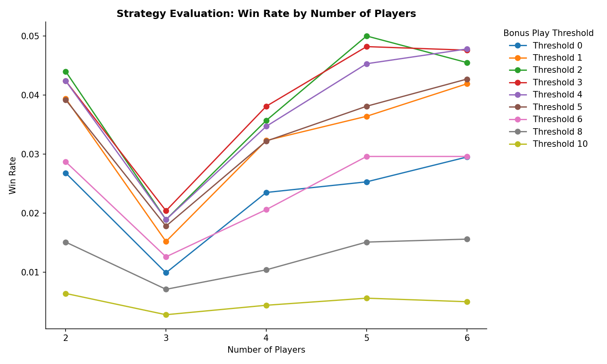
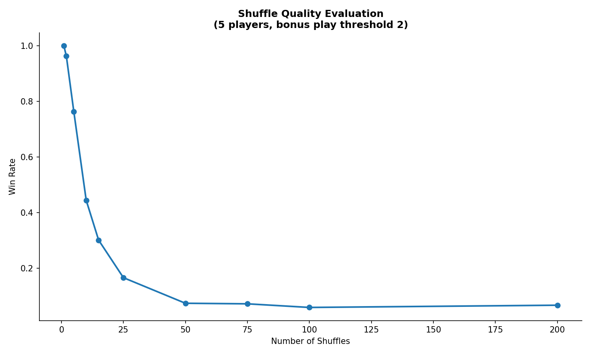
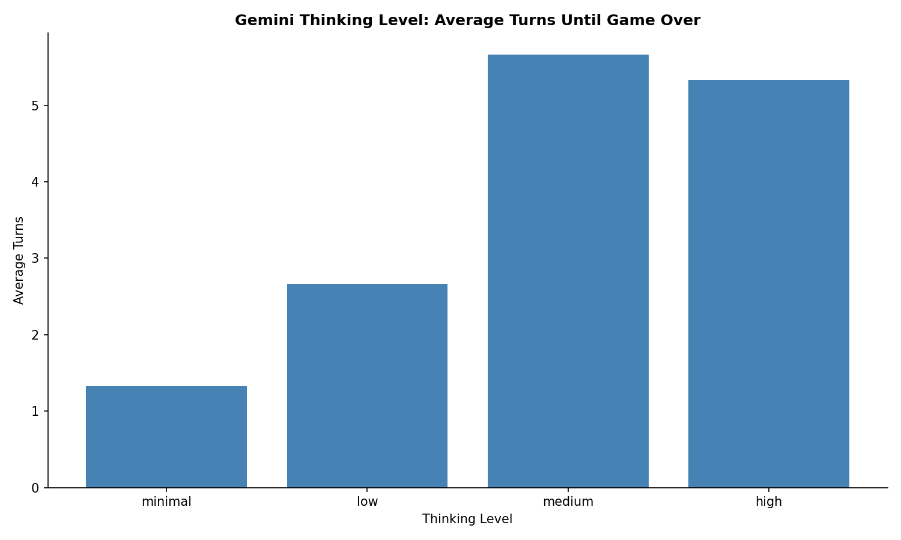

# The Game Simulation

A Monte Carlo simulation framework for analyzing strategies in
[The Game](https://boardgamegeek.com/boardgame/173090/the-game), a cooperative card game
where players work together to play all 98 cards onto four shared stacks.

## The Game Rules

- 98 cards numbered 2-99
- Four stacks: two ascending (start at 1), two descending (start at 99)
- Cards must be played in the correct direction, except for the "backwards trick":
  playing exactly 10 higher/lower resets the stack
- Each turn: play at least 2 cards (or 1 if deck is empty), then draw back to hand size
- Win condition: all cards played; lose condition: cannot make a legal play

## Results

### Strategy Evaluation

The simulation tests a "bonus play" strategy that plays additional cards beyond the
minimum required when a card is within a threshold distance from a stack top. Lower
thresholds mean more aggressive extra plays.



**Key findings:**

- Threshold 2 performs best across most player counts
- Win rates peak at 5 players (~5%)
- More conservative strategies (higher thresholds) underperform

### Shuffle Quality Impact

Using a custom cut-based shuffle algorithm, we measure how shuffle quality affects win
rates.



**Key findings:**

- Poorly shuffled decks (few shuffles) dramatically increase win rates
- With proper shuffling (50+ iterations), win rates stabilize around 5%
- This demonstrates the game's difficulty depends heavily on card distribution

### Gemini AI Thinking Levels

We test Google's Gemini model at different thinking levels as a game-playing agent.



**Key findings:**

- Higher thinking levels survive more turns before making invalid moves
- Medium and high thinking levels show similar performance
- Even with extended thinking, the AI struggles with the game's strategic depth

## Installation

```bash
pixi install
```

## Usage

Run all simulations:

```bash
pixi run pytask
```

Or run individual simulations:

```bash
pixi run python src/simulate_strategies.py
pixi run python src/simulate_shuffle_quality.py
pixi run python src/simulate_gemini_thinking.py
```

Generate plots from existing results:

```bash
pixi run python src/generate_plots.py
```

## Project Structure

```
src/
├── game_setup.py          # Core game mechanics
├── strategies.py          # Playing strategies (bonus play, Gemini)
├── utils.py               # Stack implementation, Gemini API integration
├── simulate_strategies.py # Strategy comparison simulation
├── simulate_shuffle_quality.py  # Shuffle quality analysis
├── simulate_gemini_thinking.py  # Gemini thinking level tests
└── generate_plots.py      # Visualization generation

tests/                     # Unit tests
bld/                       # Generated outputs (plots, results)
```

## Configuration

For Gemini simulations, set your API key in `.env`:

```
GEMINI_API_KEY=your_key_here
```

## License

MIT
